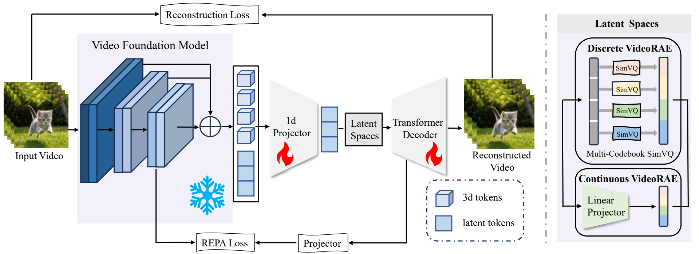

# VideoRAE: Taming Video Foundation Models for Generative Modeling via Representation Autoencoders

<div align="center">

[](https://arxiv.org/abs/2607.14088)
[](https://zhxie0117.github.io/VideoRAE/)
[](https://huggingface.co/siuuuuuuxzh/videorae)
[](https://www.modelscope.cn/models/siuuuuuuuuuuxzh/videorae)

</div>

<p align="center">
  
</p>
<p align="center"><em>Overall architecture of VideoRAE.</em></p>

**VideoRAE** turns frozen Video Foundation Models (VFMs) such as [V-JEPA 2](https://github.com/facebookresearch/vjepa2) and [VideoMAEv2](https://github.com/OpenGVLab/VideoMAEv2) into compact, reconstruction-capable, and generation-friendly video latents. Unlike conventional 3D-VAEs trained mainly for pixel reconstruction, VideoRAE:

- extracts **multi-scale hierarchical features** from a frozen VFM encoder;
- compresses them with a lightweight **1D self-attention projector**;
- supports both **continuous latents** (for DiT) and **discrete tokens** (for AR via Multi-Codebook SimVQ);
- regularizes the latent manifold with **local-and-global Representation Alignment (REPA)**, enabling training **without KL loss**.

On UCF-101, VideoRAE achieves state-of-the-art class-to-video **gFVD of 40 (AR)** and **93 (DiT)**, while converging roughly **5× faster** than competing autoencoder baselines.

---

## News

- **2026-07** — Code and paper released ([arXiv:2607.14088](https://arxiv.org/abs/2607.14088)).

## TODO

- [x] Paper released
- [x] VideoRAE checkpoints and code released
- [ ] T2V generation code and checkpoints released

---

## Installation

```bash
# Recommended: PyTorch 2.4 + CUDA 12.4
pip install torch==2.4.0 torchvision==0.19.0 torchaudio==2.4.0 \
  --index-url https://download.pytorch.org/whl/cu124

pip install -r requirements.txt
```


---

## Data Preparation

Training expects CSV metadata under `data/metadata/`, with relative video paths resolvable from the repo root (or your chosen data root).

Example CSV format:

```csv
id,path,action,label
0,data/ucf101/ApplyEyeMakeup/v_ApplyEyeMakeup_g08_c01.avi,ApplyEyeMakeup,0
```

Typical layout:

```text
data/
├── metadata/
│   ├── ucf101_train.csv
│   ├── ucf101_val.csv
│   └── kinetics_dataset.csv   #  used by provided scripts
├── ucf101/
└── kinetics/                  # or your Kinetics-600 root
```

Clips used in the paper are **16 × 256 × 256**.

> Please download UCF-101 / Kinetics-600 yourself and build the CSV files accordingly. Do **not** commit absolute machine-local paths.

---

## Training VideoRAE

Both configs assume an **8-GPU** machine by default (`-b 64`). Adjust batch size / workers for your hardware.

Before training, download the [V-JEPA 2](https://dl.fbaipublicfiles.com/vjepa2/vitl.pt) (`vitl.pt`) checkpoint.

### Continuous VideoRAE (for DiT)

```bash
bash scripts/train_rae_vjepa.sh
```


### Discrete VideoRAE (for AR)

```bash
bash scripts/train_vqrae_vjepa.sh
```


---

## Evaluation (Reconstruction)

```bash
python evalvfm/eval_larp_tokenizer.py \
  --tokenizer /path/to/videorae_checkpoint.pth \
  --dataset_csv ucf101_train.csv \
  --use_amp --det
```

This reports MSE / PSNR / rFVD / LPIPS / SSIM.


---

## V-JEPA 2.1 3D Latent for Video Generation and World Action Models

We also open-source a **3D latent VideoRAE** built on **V-JEPA 2.1**. The model architecture is defined in [`models/model_sem/auto_vjepa21_3d.py`](models/model_sem/auto_vjepa21_3d.py), which compresses V-JEPA 2.1 teacher features into a structured 3D latent volume for reconstruction and downstream modeling.

We are currently training a **video generation model** on top of this 3D latent representation, and plan to release it in a future update. We hope this line of work can be useful for downstream **video generation** and **embodied AI** applications such as **world action models**.


---

## Downstream Generation

### Continuous latents → DiT

Train a 1D DiT on frozen VideoRAE latents:

```bash
bash scripts/train_dit_vjepa.sh
```


### Discrete tokens → Autoregressive models

Train an AR transformer on discrete VideoRAE tokens with the provided AR trainers. Class-conditional generation visualizations:

```bash
bash scripts/train_ar_vjepa.sh
```

---

## Pretrained Models

Pretrained VideoRAE weights are released on [HuggingFace](https://huggingface.co/siuuuuuuxzh/videorae/tree/main).

---

## Acknowledgments

This codebase builds upon ideas and infrastructure from:

- [LARP](https://github.com/hywang66/LARP) — training / evaluation framework
- [V-JEPA 2](https://github.com/facebookresearch/vjepa2) — frozen video foundation encoder
- [VideoMAE v2](https://github.com/OpenGVLab/VideoMAEv2) — frozen video foundation encoder
- [MAETok](https://github.com/Hhhhhhao/continuous_tokenizer) — 1d diffusion codebase
- Related latent generative modeling efforts such as DiT / LlamaGen-style AR stacks

We thank [江毅 (Yi Jiang)](https://enjoyyi.github.io/) for his personal guidance and support.

---

## Citation

If you find this code useful in your research, please consider citing:

```bibtex
@article{xie2026videorae,
  title={VideoRAE: Taming Video Foundation Models for Generative Modeling via Representation Autoencoders},
  author={Xie, Zhihao and Wu, Junfeng and Hu, Xinting and Huang, Junchao and Jiang, Li},
  journal={arXiv preprint arXiv:2607.14088},
  year={2026}
}
```

